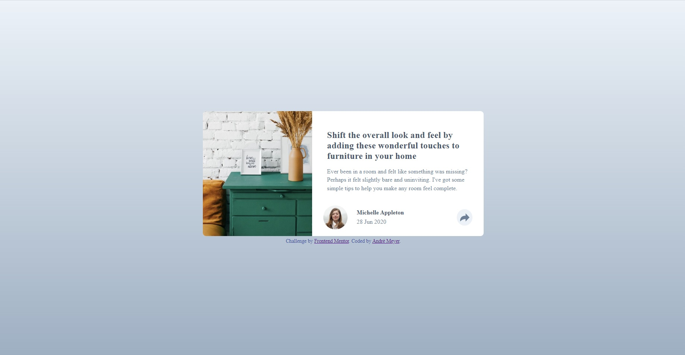
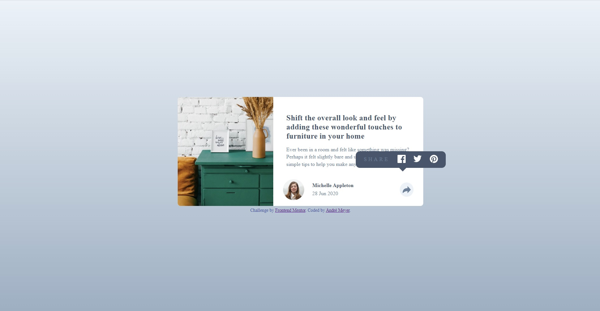
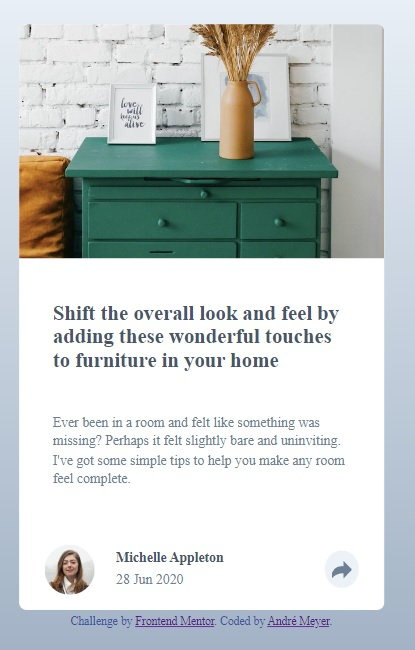
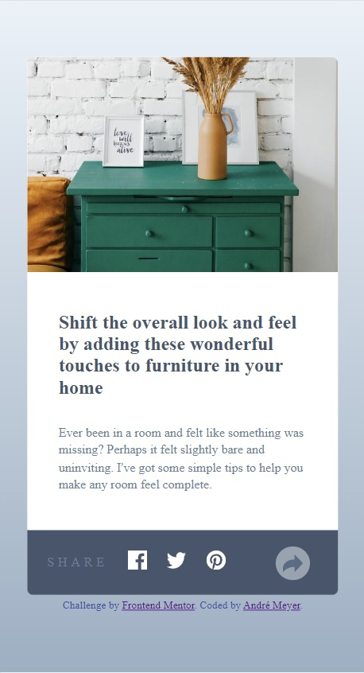

# Frontend Mentor - Social proof section solution

This is a solution to the [Article preview component challenge on Frontend Mentor](https://www.frontendmentor.io/challenges/article-preview-component-dYBN_pYFT). Frontend Mentor challenges help you improve your coding skills by building realistic projects. 

## Table of contents

- [Overview](#overview)
- [The challenge](#the-challenge)
- [Screenshot](#screenshot)
- [Links](#links)
- [Author](#author)

## Overview

### The challenge

Users should be able to:

- View the optimal layout for the component depending on their device's screen size
- See the social media share links when they click the share icon

### Screenshot

### Links

- Solution URL: (https://github.com/dev-andrewm/article-preview-component)
- Live Site URL: (https://dev-andrewm.github.io/article-preview-component/)

## My process

### Built with

- Semantic HTML5 markup
- Flexbox
- Mobile first workflow
- BEM Metmethodology

## Author

- Frontend Mentor - [@dev-andrewm](https://www.frontendmentor.io/profile/dev-andrewm)
- LinkedIn - [@meyer-andre](https://www.linkedin.com/in/meyer-andre)
